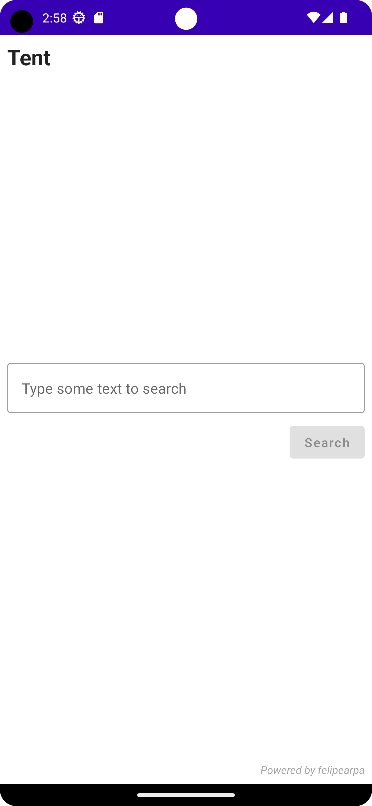
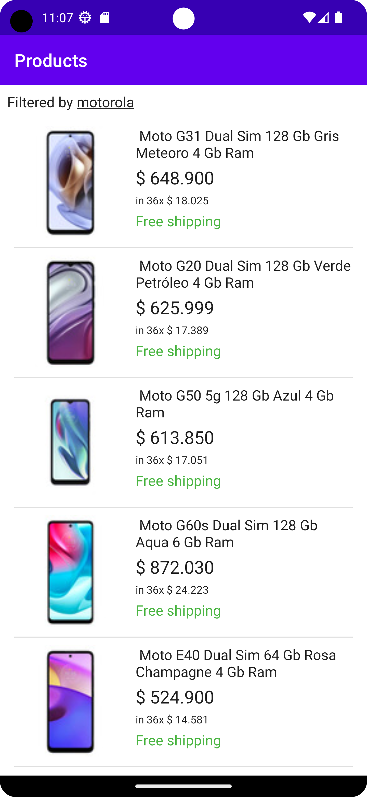
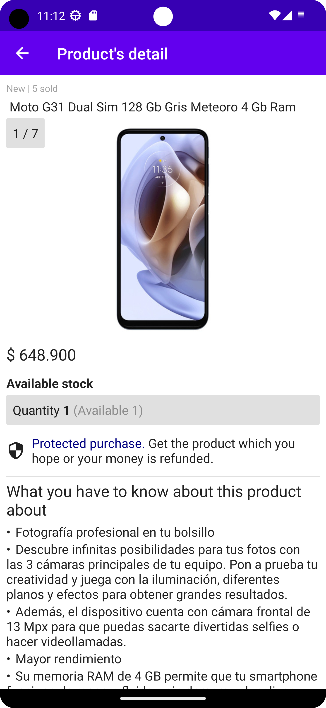

# Tent

## About

It's a demo app to show how to consume [Mercadolibre](www.mercadolibre.com) API. 
It permits you to filter a list of product and to see that product's detail.
It was powered by felipearpa.

## How to use it?

When you run the app this view is displayed:

### Home



In this view, you must type som text and to tap the confirm button, then this view will be displayed:

### Product's list



You can do:

* If you wish going to home view, you must tap text which shows the filter.

* If you wish knowing the product's detail, you must tap the product's card., 

* If you wish reload the product's list, you must swipe down on the view's top.

### Product's detail



You can see the product's images by swiping left or right on the displayed image.

## What kind of tools were used to build it?

It was built entirely using by **Jetpack Compose**, and tools like retrofit, dagger hilt, and others.

## What is the software architecture?

The software architecture used is a layered architecture and it has 3 layers:

- **Data**: This layer contains the data sources, in this case, only the remote data sources; and the repositories.
- **Domain**: This layer contains the business logic, in this case, it contains validations for the data type and it was implemented using *strong type design*, avoiding the concept of *primitive obsession*. 
Also it contains the use cases to query the products.
- **View**: This layer contains all visual elements needed to show the info to end user.

## Is it async?

It's async using by coroutines. For example, querying the product's detail, detail and description of product are returned by different endpoints so it was implemented like that:

```kotlin
coroutineScope {
    val productDetailResultDeferred = async {
        productRepository.findDetail(productId = productId)
    }

    val productDescriptionResultDeferred = async {
        findProductDescriptionUseCase.execute(productId = productId)
    }

    val productDetailResult = productDetailResultDeferred.await()
    val productDescriptionResult = productDescriptionResultDeferred.await()

    if (productDetailResult.isFailure || productDescriptionResult.isFailure)
        return@coroutineScope Result.failure(RuntimeException())

    val fullProductDetail = productDetailResult.getOrNull()!!.copy(
        description = productDescriptionResult.getOrNull()!!
    )

    return@coroutineScope Result.success(fullProductDetail)
}
```

Detail and description of product are querying in different coroutines and then they are merged in one only model.

## How many languages are supported?

It's available in spanish and english.